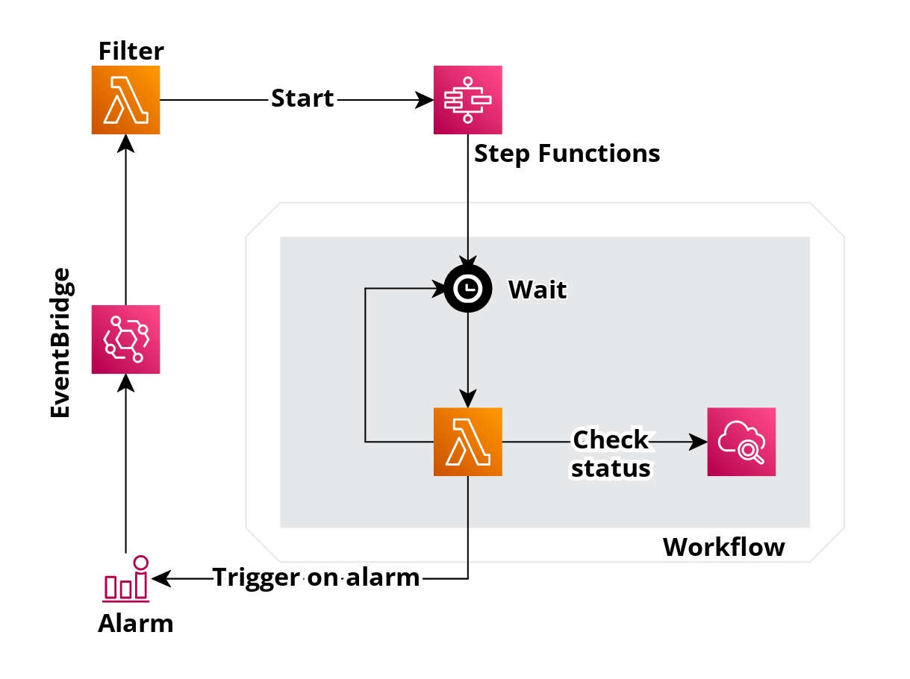

# AWS Alarms Repeater

### Motivation
Background story and motivation can be found under
https://medium.com/@sodkiewiczm/aws-repeating-alarms-d3e4ffebfbf3

## Diagram

## Config

### Disabling alarms repeater
Solution is based on the opt-out, so by default all your non-autoscaling alarms will be taken into account.
How to turn this mechanism off? Just tag your alarm with `AlarmRepeaterEnabled` with value `false`

### Setting checking alarm interval
Unfortunately due to https://github.com/aws/serverless-application-model/issues/1616 this value has to be changed in template manually

## Deployment
Solution is based on AWS SAM. Example deployment can be found in Makefile and started with
``make deploy``
